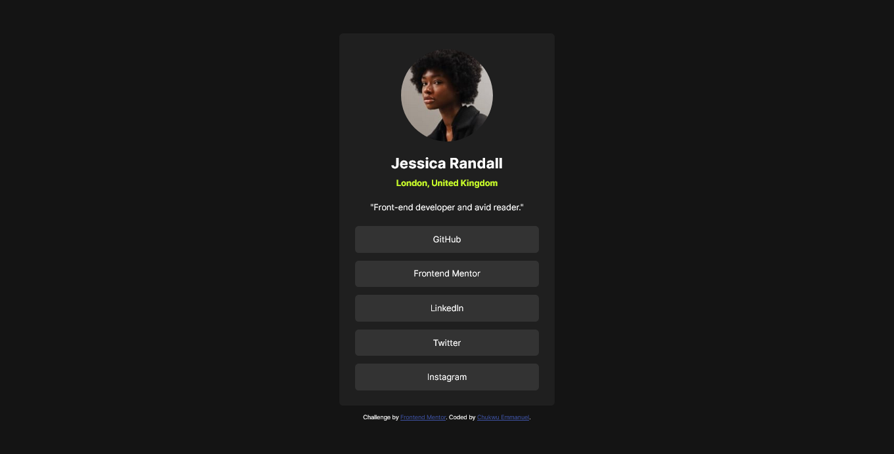
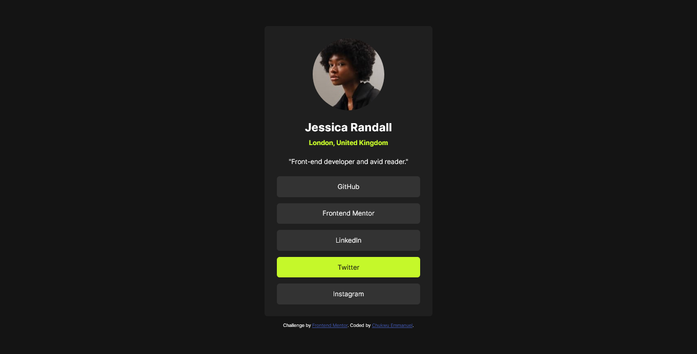
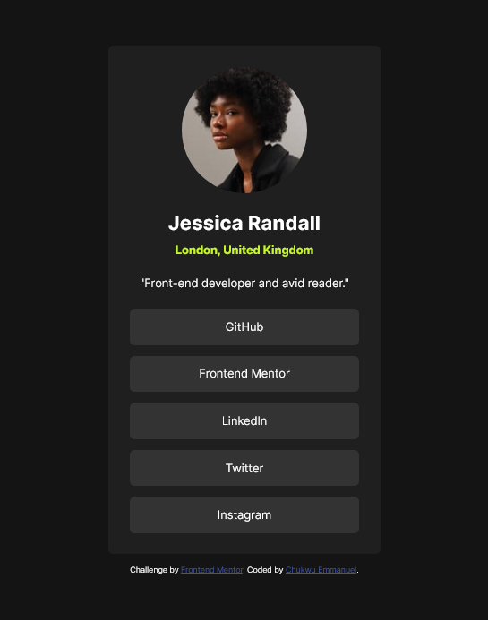

# Frontend Mentor - Social links profile solution

This is a solution to the [Social links profile challenge on Frontend Mentor](https://www.frontendmentor.io/challenges/social-links-profile-UG32l9m6dQ). Frontend Mentor challenges help you improve your coding skills by building realistic projects. 

## Table of contents

- [Overview](#overview)
  - [The challenge](#the-challenge)
  - [Screenshot](#screenshot)
- [My process](#my-process)
  - [Built with](#built-with)
  - [What I learned](#what-i-learned)
  - [Continued development](#continued-development)
  - [Useful resources](#useful-resources)
- [Author](#author)
- [Acknowledgments](#acknowledgments)

## Overview

### The challenge

Users should be able to:

- See hover and focus states for all interactive elements on the page

### Screenshot

## My process

### Built with

- Semantic HTML5 markup
- CSS custom properties
- Flexbox

### What I learned

This was a good project and I learnt alot from it, like from the html to css; there's a whole of new tricks on how to get the work done.

### Continued development

I want to really learn more on responsiveness, working through it really gives me a tough time.

### Useful resources

- [Example resource 1](https://www.appbrewery.com) - This helped me for my programming journey so far. I really liked this pattern and will use it going forward.
- [Example resource 2](https://www.developer.mozilla.org) - This is an amazing article which helped me finally understand some coding terminology. I'd recommend it to anyone still learning this concept.

## Author

- Frontend Mentor - [@Degreatdo](https://www.frontendmentor.io/profile/Degreatdo)

## Acknowledgments

Shoutout to Dr. Angela Yu for her great teaching skills, she makes learning programming seem easy.
Also I won't fail to mention about stackoverflow.com, it's really a helping space for programmers.
